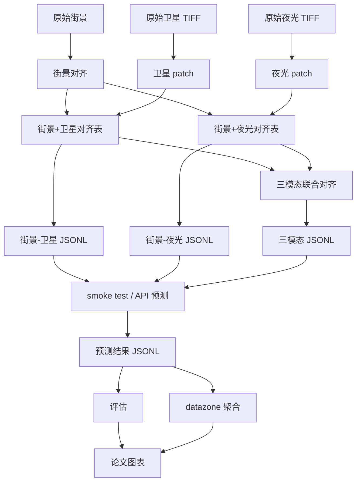

# Glasgow VLM 项目工作流程

本文档说明项目从原始数据到最终结果的完整流程。当前主线是 `Qwen3-VL-Plus` API 预测，同时保留三条可并行比较的分析分支：

- 街景 + 卫星
- 街景 + 夜光
- 街景 + 卫星 + 夜光

## 1. 目标

项目要做的是把 Glasgow 的街景、遥感和夜光信息结合起来，用于城市不平等分析，并与 SIMD 标签对照。

最终希望得到：

- 样本级预测
- datazone 级聚合结果
- 双模态、夜光、三模态的对比评估
- 可直接放进论文的空间分布图和误差分析图

## 2. 原始数据

核心原始输入有三类：

- `dataset/streetview_dataset`
  - 街景图像和元数据
- `dataset/satellite_dataset`
  - `glasgow/glasgow.tif`
  - `glasgow_ntl/glasgow_ntl.tif`
  - `satellite_patches`
  - `satellite_ntl_patches`
- `SIMD`
  - `SIMD2020v2_Rank`
  - `SIMD2020v2_Quintile`

这些文件是根数据，后续所有结果都从它们派生。

## 3. 三条分析分支

### 3.1 街景 + 卫星

- 街景来自 `dataset/streetview_dataset/images`
- 卫星 patch 来自 `dataset/satellite_dataset/satellite_patches`
- 对齐结果在 `dataset/streetview_satellite_aligned`

用途：

- 作为最基础的双模态对比实验
- 检验街景与城市形态的互补性

### 3.2 街景 + 夜光

- 街景仍然来自 `dataset/streetview_dataset/images`
- 夜光 patch 来自 `dataset/satellite_dataset/satellite_ntl_patches`
- 对齐结果在 `dataset/streetview_ntl_aligned`

用途：

- 检验夜光信息是否能补充不平等分析
- 作为独立的双模态分支与卫星分支对照

### 3.3 街景 + 卫星 + 夜光

- 同时输入三张图
- 三模态联合对齐表在 `dataset/streetview_satellite_ntl_aligned`

用途：

- 验证多模态融合是否比任意双模态更强
- 做论文里的主实验或增强实验

## 4. 工作流总览

## 5. 每一步做什么

### 步骤 1：构建对齐表

脚本：

- `scripts/build_streetview_prefix_satellite_alignment.py`
- `scripts/build_streetview_ntl_alignment.py`

作用：

- 根据街景位置找到对应的卫星或夜光 patch
- 输出 CSV / JSON / summary

### 步骤 2：构建三模态联合对齐表

脚本：

- `scripts/build_streetview_satellite_ntl_alignment.py`

作用：

- 把双模态卫星对齐表和夜光对齐表合并
- 让每条样本同时拥有：
  - `streetview_path`
  - `satellite_path`
  - `ntl_path`

### 步骤 3：生成 JSONL

脚本：

- `scripts/build_vlm_jsonl.py`

作用：

- 把对齐表转换成 VLM 可读的 JSONL
- 自动写入 prompt、答案和训练/验证/测试切分

支持的 `input_mode`：

- `streetview`
- `satellite`
- `dual`
- `triple`

### 步骤 4：smoke test

脚本：

- `scripts/smoke_test_vlm_pipeline.py`

作用：

- 检查路径是否存在
- 检查图片是否可读
- 检查 `answer_json` 是否有效

这一步不调用模型，只做数据验证。

### 步骤 5：Qwen3-VL-Plus API 预测

脚本：

- `scripts/predict_qwen3_vl_plus_api.py`

作用：

- 把样本中的图片编码成 base64
- 调用 DashScope OpenAI-compatible API
- 输出 `prediction_text` 和 `prediction_json`

支持：

- 双模态小批量预览
- 夜光小批量预览
- 三模态小批量预览
- 全量预测

### 步骤 6：评估

脚本：

- `scripts/evaluate_predictions.py`

作用：

- 比较预测和 gold 标签
- 输出分类、排序、回归类指标

### 步骤 7：datazone 聚合

脚本：

- `scripts/aggregate_datazone_predictions.py`

作用：

- 将样本级预测汇总成 `datazone` 级结果
- 便于和 SIMD 做空间层面对比

## 6. 最终结果

跑通后你会得到：

- 双模态、夜光、三模态三套预测结果
- 样本级和 datazone 级输出
- 论文可用的图表和对比结果
- 一套可复现的 Glasgow 城市不平等分析流程
