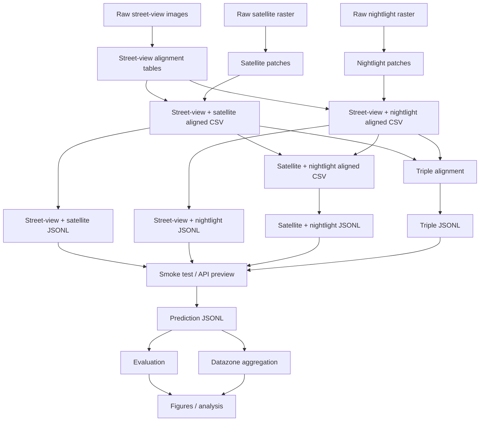

# Glasgow VLM 项目工作流

本文档说明当前格拉斯哥城市不平等 VLM 项目的完整流程，并与现有英文版 README 保持一致。

## 1. 项目在做什么

本项目使用多模态视觉证据研究格拉斯哥城市贫困分布，输入模态包括：

- 街景图像
- 遥感图像
- 夜光图像

当前重点是空间对齐、JSONL 生成、结构化 `explain` 推理、评估，以及 datazone 级聚合。

当前重要事实：

- `build_vlm_jsonl.py` 不再合并 SIMD 标签
- 独立的 `rank` 任务已经从主流程中移除
- `explain` 是当前主要的结构化分析任务
- `ordinal` 仍然在 JSONL 生成器中保留，用于五级分类式输出

## 2. 当前目录结构

- `dataset/streetview_dataset`
  - 原始街景图像
- `dataset/satellite_dataset`
  - 原始遥感 TIFF 和派生 patch
  - `satellite_patches`
  - `satellite_ntl_patches`
- `dataset/streetview_satellite_aligned`
  - 街景 + 遥感对齐结果
- `dataset/streetview_ntl_aligned`
  - 街景 + 夜光对齐结果
- `dataset/satellite_ntl_aligned`
  - 遥感 + 夜光对齐结果
- `dataset/streetview_satellite_ntl_aligned`
  - 街景 + 遥感 + 夜光三模态对齐结果
- `outputs/predictions`
  - API 预览结果和完整预测 JSONL
- `src/glasgow_vlm`
  - prompt 构建、数据读取、指标和辅助逻辑

## 3. 总体流程



## 4. 逐步流程

### 第一步：构建空间对齐

下面这些脚本负责生成空间配对表，在需要时保存 patch。

- `scripts/build_streetview_prefix_satellite_alignment.py`
  - 构建街景 + 遥感对齐表
- `scripts/build_streetview_ntl_alignment.py`
  - 构建街景 + 夜光对齐表
- `scripts/build_satellite_ntl_alignment.py`
  - 构建遥感 + 夜光配对表
- `scripts/build_streetview_satellite_ntl_alignment.py`
  - 将街景 + 遥感和街景 + 夜光结果合并成三模态对齐表

典型输出：

- `dataset/streetview_satellite_aligned/streetview_prefix_satellite_alignment.csv`
- `dataset/streetview_ntl_aligned/streetview_ntl_alignment.csv`
- `dataset/satellite_ntl_aligned/satellite_ntl_alignment.csv`
- `dataset/streetview_satellite_ntl_aligned/streetview_satellite_ntl_alignment.csv`

### 第二步：生成纯空间 JSONL

`scripts/build_vlm_jsonl.py` 会把对齐 CSV 转成 VLM JSONL 文件。

支持的 `--input-mode`：

- `streetview`
- `satellite`
- `dual`
- `satellite_ntl`
- `triple`

支持的 `--task`：

- `explain`
- `ordinal`

这一步不再合并 SIMD 标签。

典型输出：

- `*_train.jsonl`
- `*_val.jsonl`
- `*_test.jsonl`
- `*_all.jsonl`

### 第三步：做 smoke test

smoke test 用于在推理前快速验证生成的 JSONL。

脚本：

- `scripts/smoke_test_vlm_pipeline.py`

它会检查：

- 必需字段是否存在
- 图像路径是否可读
- prompt 是否能解析
- 在当前“纯空间对齐”流程中，`answer_json` 是可选项

### 第四步：运行 Qwen3-VL-Plus API 预览

这是主要推理入口。

脚本：

- `scripts/predict_qwen3_vl_plus_api.py`

它会做这些事情：

- 读取 JSONL 记录
- 将选中的图像编码为 base64 data URL
- 调用 DashScope OpenAI-compatible API
- 将结构化输出写入 `outputs/predictions/*.jsonl`
- 支持 resume / overwrite，用于长时间运行

保存的结果行包含：

- `id`
- `datazone`
- `prediction_text`
- `prediction_json`
- `model`

### 第五步：评估预测

脚本：

- `scripts/evaluate_predictions.py`

它会根据 gold JSONL 和 prediction JSONL 计算评估指标。

### 第六步：聚合到 datazone 级别

脚本：

- `scripts/aggregate_datazone_predictions.py`

它会把样本级预测聚合到 `datazone` 层，用于空间比较和后续分析。

## 5. 推荐执行顺序

建议按下面顺序执行：

1. 构建目标对齐表
2. 生成对应 JSONL
3. 运行 smoke test
4. 用 `--max-samples 5` 做小批量 API 预览
5. 如果预览结果正常，再跑全量预测
6. 评估预测结果
7. 聚合到 datazone 层
8. 将输出用于作图和分析

## 6. 常用运行模式

### 三模态 explain 预览

```powershell
.\.venv\Scripts\python.exe scripts\predict_qwen3_vl_plus_api.py --input-jsonl dataset/streetview_satellite_ntl_aligned/vlm_data/triple_explain_test.jsonl --output-jsonl outputs/predictions/qwen3_vl_plus_triple_preview.jsonl --input-mode triple --task explain --max-samples 5
```

### 街景 + 遥感 explain 预览

```powershell
.\.venv\Scripts\python.exe scripts\predict_qwen3_vl_plus_api.py --input-jsonl dataset/streetview_satellite_aligned/vlm_data/dual_explain_test.jsonl --output-jsonl outputs/predictions/qwen3_vl_plus_streetview_satellite_preview.jsonl --input-mode dual --task explain --max-samples 5
```

### 街景 + 夜光 explain 预览

```powershell
.\.venv\Scripts\python.exe scripts\predict_qwen3_vl_plus_api.py --input-jsonl dataset/streetview_ntl_aligned/vlm_data/dual_explain_test.jsonl --output-jsonl outputs/predictions/qwen3_vl_plus_streetview_ntl_preview.jsonl --input-mode dual --task explain --max-samples 5
```

### 遥感 + 夜光 explain 预览

```powershell
.\.venv\Scripts\python.exe scripts\predict_qwen3_vl_plus_api.py --input-jsonl dataset/satellite_ntl_aligned/vlm_data/satellite_ntl_explain_test.jsonl --output-jsonl outputs/predictions/qwen3_vl_plus_satellite_ntl_preview.jsonl --input-mode satellite_ntl --task explain --max-samples 5
```

## 7. 重要说明

- `predict_qwen3_vl_plus_api.py` 支持断点续跑，因此即使机器中途停止，也可以重新执行同一条命令继续跑。
- `build_vlm_jsonl.py` 不再依赖 SIMD 标签。
- 独立的 `rank` 任务已经从主流程中移除。
- 当前工作流的重点是可复现的推理流程和跨模态比较。

## 8. 最终输出

完整跑通后，应该得到：

- 各种模态组合的对齐 CSV / JSONL
- 经过 smoke test 的 JSONL 输入
- API 预测 JSONL 文件
- 评估指标
- datazone 级聚合表
- 用于论文的图表和定性案例
